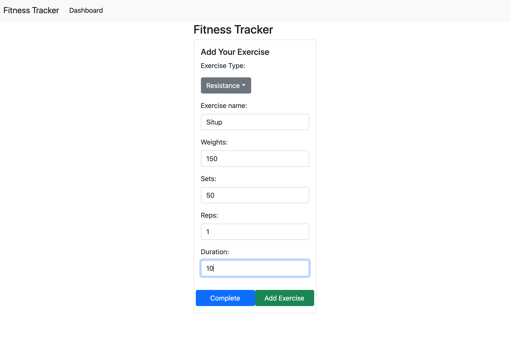

# Fitness Tracker

## Description

Fitness Tracker is an web application that keeps track of the user's workout data. It lets the user create workouts and lets the user create mulitple exercises for each of their workouts. It also has a dashboard that displays a chart with info from the user's last workout.

## Installation

To run the application:

- Run the command `npm i` to install all necessary packages

## Usage

Run the command `node server.js` to start the server.

Go to the browser and type `localhost:3000` to arrive at the home page.

Click on the "New Workout" button to create a new workout and start adding new exercises to that workout.

Click on the "Continue Workout" button to add new exercises to the last workout.

When on the exercise page, fillout the form for a new exercise. When done, click on the "Complete" button to add that new exercise to the database and return to the home page, or click on the "Add exercise" button to keep adding new exercises to the currently active workout.

## Credits

hugh18019  
GitHub Profile: https://github.com/hugh18019

## License

Licensed under the [MIT License](LICENSE).
